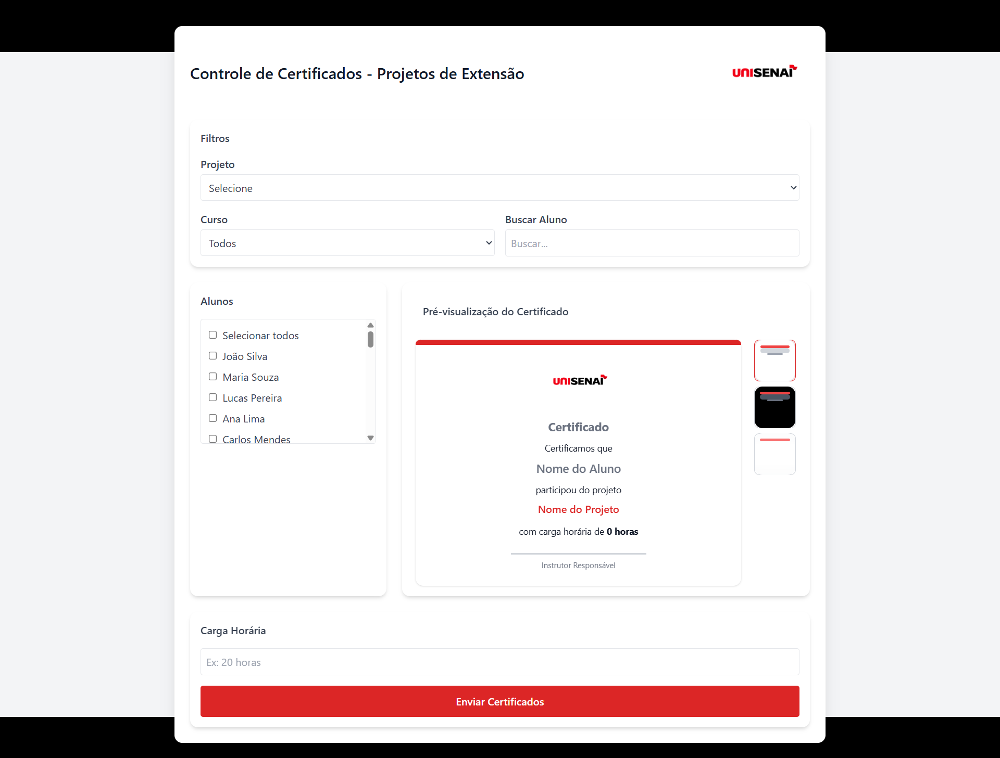

#  Sistema de Gestão de Extensão Acadêmica

Projeto desenvolvido para facilitar o controle de horas de extensão em instituições de ensino.

## 🌐 Acesse o projeto
[🔗 Clique aqui para acessar o sistema ](https://controle-certificados-peach.vercel.app/)

---

## Sobre o projeto

Este sistema foi criado para resolver um problema real da faculdade:  
a ausência de um sistema para controle de horas de extensão.

A aplicação permite que docentes gerenciem alunos, filtrem informações e gerem certificados automaticamente.

---

## Preview

---

## Funcionalidades

- Filtro por curso (ADS, Mecatrônica, Engenharia)
- Busca por nome de aluno
- Seleção de projetos de extensão
- Escolha de template de certificado (Light/Dark)
- Geração automática de certificado em PDF
- Interface intuitiva para docentes

---

## 🛠️ Tecnologias utilizadas

### Frontend
- Vite
- React
- Tailwind CSS

### Backend (em desenvolvimento)
- Node.js
- Integração futura com envio de e-mail

---

## Responsividade

O sistema foi desenvolvido com foco em responsividade, garantindo uma boa experiência em:

- 💻 Desktop  
- 📱 Mobile  
- 📲 Tablet  

---

## ⚙️ Como funciona

1. O docente filtra por curso ou busca pelo nome
2. Seleciona o projeto de extensão
3. Define a carga horária
4. Escolhe o modelo de certificado
5. O sistema gera automaticamente o certificado em PDF

---

## 📌 Status

🚧 Em desenvolvimento  
✔️ Geração de PDF funcional  
🔄 Integração com envio de e-mail em andamento  

---

